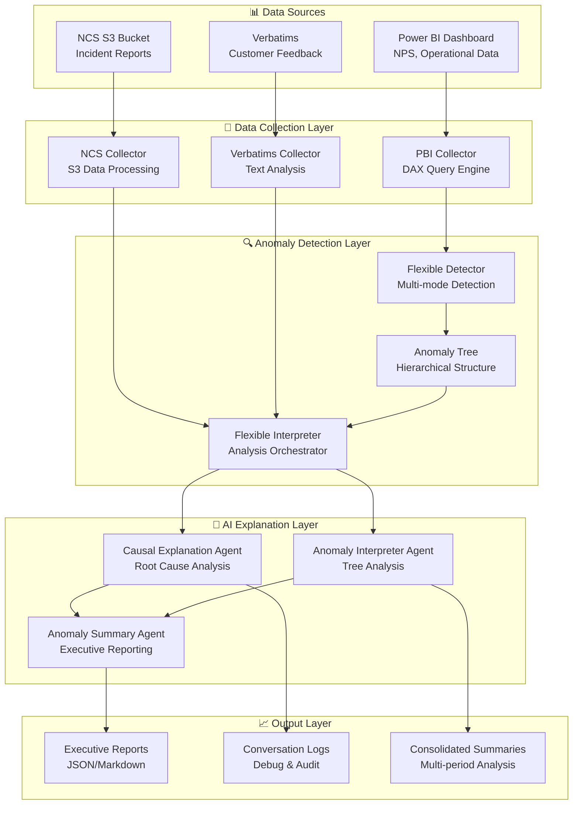

# 🚀 Iberia NPS Anomaly Detection & Explanation System

[](https://www.python.org/downloads/)
[](https://openai.com/)
[](https://docs.microsoft.com/en-us/power-bi/)

A comprehensive **AI-powered anomaly detection and explanation system** for Net Promoter Score (NPS) analysis in the airline industry. This system automatically detects NPS anomalies across hierarchical customer segments, investigates root causes using multiple data sources, and generates executive-level insights through intelligent AI agents.

---

## 📋 **Table of Contents**

- [🎯 Overview](#-overview)
- [🏗️ System Architecture](#️-system-architecture)
- [📊 Data Sources](#-data-sources)
- [🔧 Core Modules](#-core-modules)
- [🤖 AI Agents](#-ai-agents)
- [⚙️ Installation & Setup](#️-installation--setup)
- [🚀 Usage](#-usage)
- [📈 Analysis Modes](#-analysis-modes)
- [🔍 Debug & Monitoring](#-debug--monitoring)
- [📝 Configuration](#-configuration)
- [🌐 API Integration](#-api-integration)
- [📚 Advanced Features](#-advanced-features)

---

## 🎯 **Overview**

The **Iberia NPS Anomaly Detection & Explanation System** is an enterprise-grade solution that:

- **🔍 Automatically detects** NPS anomalies across hierarchical customer segments
- **📊 Investigates root causes** using operational data, customer feedback, and incident reports
- **🤖 Employs AI agents** for intelligent causal analysis and explanation generation
- **📈 Supports multiple analysis modes** (comparative vs. single period, weekly vs. daily)
- **🎯 Provides executive insights** with actionable recommendations and trend analysis
- **⚡ Scales horizontally** across different time aggregations (1d, 7d, 14d, 30d)

### **Key Features:**

- **Multi-source data integration**: Power BI, NCS incidents, customer verbatims
- **Hierarchical anomaly detection**: Global → Radio (LH/SH) → Cabin → Company level analysis
- **Intelligent AI explanations**: OpenAI GPT-4 and AWS Bedrock integration
- **Flexible time periods**: Configurable aggregation from daily to monthly analysis
- **Executive reporting**: Automated summary generation with trend identification
- **Real-time monitoring**: Comprehensive logging and debug capabilities

---

## 🏗️ **System Architecture**



---

## 📊 **Data Sources**

### **1. 🔷 Power BI Dashboard**
- **Primary source** for NPS metrics and operational data
- **Authentication**: Microsoft Azure AD with service principal
- **Query language**: DAX (Data Analysis Expressions)
- **Data types**: Daily NPS, operational metrics, customer profiles, routes
- **Hierarchy**: Global → Long Haul/Short Haul → Economy/Business/Premium → IB/YW

### **2. 🟠 NCS (Non-Compliance System)**
- **Source**: AWS S3 bucket (`ibdata-prod-ew1-s3-customer`)
- **Content**: Operational incident reports, flight disruptions, customer complaints
- **Format**: CSV files with structured incident data
- **Authentication**: AWS IAM with temporary credentials
- **Coverage**: All operational incidents affecting customer experience

### **3. 🟢 Customer Verbatims**
- **Source**: Customer feedback text from surveys and chatbot interactions
- **Processing**: NLP-based theme extraction and sentiment analysis
- **Categories**: Baggage, punctuality, onboard service, reservations, airport experience
- **Language support**: Spanish, English, and other languages
- **Integration**: Linked to NPS surveys via Survey_ID

---

## 🔧 **Core Modules**

### **📁 Data Collection (`data_collection/`)**

#### **`pbi_collector.py`** - Power BI Data Collection Engine
```python
class PBIDataCollector:
    """Collects data from Power BI API for hierarchical NPS analysis"""
    
    # Key Methods:
    - collect_flexible_nps_data()     # NPS metrics with flexible aggregation
    - collect_operative_data()        # Operational KPIs (OTP, Load Factor)
    - collect_explanatory_drivers()   # SHAP-based driver analysis
    - collect_routes_data()           # Route-specific NPS performance
    - collect_customer_profile()      # Customer segmentation analysis
```

**Features:**
- ✅ Hierarchical segment filtering (Global/LH/Business/IB)
- ✅ Flexible time aggregation (1d, 7d, 14d, 30d)
- ✅ Dynamic DAX query generation with templating
- ✅ Microsoft Authentication Library (MSAL) integration
- ✅ Support for 9 comparison filters (vs L7d, vs LM, vs Target, etc.)

#### **`ncs_collector.py`** - Incident Data Collection
```python
class NCSDataCollector:
    """Collects operational incidents from AWS S3"""
    
    # Key Methods:
    - collect_incidents_for_period()  # Time-range incident collection
    - filter_by_route()              # Route-specific incident filtering
    - categorize_incidents()         # Incident type classification
    - calculate_impact_metrics()     # Passenger impact assessment
```

#### **`chatbot_verbatims_collector.py`** - Customer Feedback Analysis
```python
class ChatbotVerbatimsCollector:
    """Processes customer verbatims for qualitative insights"""
    
    # Key Methods:
    - analyze_themes()               # Theme extraction and categorization
    - sentiment_analysis()           # Positive/negative sentiment scoring
    - route_extraction()             # Route mentions in feedback
    - keyword_detection()            # Service issue identification
```

### **📁 Anomaly Detection (`anomaly_detection/`)**

#### **`flexible_detector.py`** - Multi-Mode Anomaly Detection
```python
class FlexibleAnomalyDetector:
    """Supports three detection modes with configurable baselines"""
    
    # Detection Modes:
    - "target"  # Compare against monthly/quarterly targets
    - "mean"    # Compare against rolling average baseline
    - "vslast"  # Compare against previous period
    
    # Key Methods:
    - analyze_flexible_anomalies()   # Main detection algorithm
    - _detect_target_anomalies()     # Target-based detection
    - _detect_legacy_anomalies()     # Mean/vslast detection
```

**Anomaly Classification:**
- **POSITIVE**: NPS improvement above threshold
- **NEGATIVE**: NPS deterioration below threshold  
- **NORMAL**: NPS within expected range

#### **`anomaly_tree.py`** - Hierarchical Data Structure
```python
class AnomalyTree:
    """Manages hierarchical customer segment structure"""
    
    # Hierarchy Levels:
    Global/
    ├── LH (Long Haul)/
    │   ├── Economy/ [IB, YW]
    │   ├── Business/ [IB, YW]
    │   └── Premium/ [IB, YW]
    └── SH (Short Haul)/
        ├── Economy/ [IB, YW]
        └── Business/ [IB, YW]
```

#### **`flexible_anomaly_interpreter.py`** - Analysis Orchestration
```python
class FlexibleAnomalyInterpreter:
    """Orchestrates anomaly explanation across multiple data sources"""
    
    # Modes:
    - "raw"    # Detailed data dumps for technical analysis
    - "agent"  # AI-powered causal explanation via LLMs
    
    # Key Methods:
    - explain_anomaly()              # Main explanation workflow
    - _initialize_causal_agent()     # AI agent setup
    - _generate_explanation()        # Consolidate multi-source analysis
```

### **📁 AI Explanation Engine (`anomaly_explanation/`)**

#### **`genai_core/agents/`** - Intelligent AI Agents

##### **`causal_explanation_agent.py`** - Root Cause Investigation
The **primary AI agent** for investigating individual segment anomalies:

```python
class CausalExplanationAgent:
    """Investigates anomalies using multiple analytical tools"""
    
    # Available Tools:
    - explanatory_drivers_tool()     # SHAP-based factor analysis
    - operative_data_tool()          # Operational metrics correlation
    - ncs_tool()                     # Incident impact analysis
    - routes_tool()                  # Route-specific performance
    - verbatims_tool()               # Customer feedback themes
    - customer_profile_tool()        # Segment reactivity analysis
```

**Operating Modes:**
- **🔄 Comparative Mode**: Compares current period vs. reference period (L7d, LM, vs Target)
- **📊 Single Mode**: Analyzes absolute values with correlation analysis for isolated periods

**Tool Execution Flow:**
```
Comparative: explanatory_drivers_tool → operative_data_tool → ncs_tool → routes_tool → verbatims_tool → customer_profile_tool
Single: operative_data_tool → ncs_tool → routes_tool → verbatims_tool → customer_profile_tool
```

##### **`anomaly_interpreter_agent.py`** - Tree Structure Analysis
```python
class AnomalyInterpreterAgent:
    """Analyzes hierarchical anomaly patterns across segment tree"""
    
    # Key Methods:
    - interpret_anomaly_tree()       # Tree-wide pattern analysis
    - identify_relationships()       # Parent-child anomaly correlation
    - generate_hierarchy_insights()  # Multi-level trend identification
```

##### **`anomaly_summary_agent.py`** - Executive Reporting
```python
class AnomalySummaryAgent:
    """Generates executive-level insights and strategic recommendations"""
    
    # Key Methods:
    - generate_comprehensive_summary()  # Weekly + daily consolidation
    - generate_summary_report()         # Multi-period trend analysis
    - identify_strategic_priorities()   # Action item prioritization
```

---

## 🤖 **AI Agents**

### **🔍 Causal Explanation Agent**

**Purpose**: Investigates root causes of individual segment anomalies using multiple data sources.

**Key Capabilities:**
- **🧠 Intelligent tool selection** based on anomaly type and data availability
- **🔗 Multi-source correlation** between NPS changes and operational metrics
- **💬 Natural language explanations** with confidence levels and evidence
- **⚡ Adaptive analysis** with dynamic tool execution based on findings

**Tool Arsenal:**

| Tool | Comparative Mode | Single Mode | Primary Use |
|------|------------------|-------------|-------------|
| **🔢 Explanatory Drivers** | SHAP value changes vs. reference | N/A | Identify main satisfaction drivers |
| **📊 Operative Data** | Metric changes vs. baseline | Absolute values + correlation | OTP, Load Factor, Mishandling analysis |
| **🚨 NCS Incidents** | Incident count changes | Absolute incident counts | Operational disruption impact |
| **✈️ Routes** | Route NPS changes | Absolute route NPS | Geographic impact analysis |
| **💬 Verbatims** | Theme/sentiment changes | Absolute themes/sentiment | Customer voice analysis |
| **👥 Customer Profile** | Segment reactivity vs. baseline | Absolute segment NPS | Customer sensitivity analysis |

### **🌳 Anomaly Interpreter Agent**

**Purpose**: Analyzes patterns across the entire hierarchical segment tree.

**Capabilities:**
- **📈 Pattern recognition** across multiple hierarchy levels
- **🔗 Relationship mapping** between parent and child segments
- **🎯 Trend identification** for strategic decision making
- **📊 Anomaly propagation analysis** through segment hierarchy

### **📋 Anomaly Summary Agent**

**Purpose**: Consolidates multi-period analysis into executive reports.

**Features:**
- **📑 Weekly + Daily integration** with narrative flow
- **📈 Trend analysis** across multiple time periods
- **🎯 Strategic insights** with actionable recommendations
- **📊 Executive dashboards** with KPI highlighting

---

## ⚙️ **Installation & Setup**

### **Prerequisites**
- **Python 3.12+**
- **Docker** (optional, for containerized deployment)
- **Power BI Premium** workspace access
- **AWS S3** access for NCS data
- **OpenAI API** or **AWS Bedrock** access

### **1. 📦 Clone Repository**
```bash
git clone <repository-url>
cd dashboard_analyzer
```

### **2. 🐍 Python Environment Setup**
```bash
# Create virtual environment
python -m venv venv
source venv/bin/activate  # Linux/Mac
# or
venv\Scripts\activate     # Windows

# Install dependencies
pip install -r requirements.txt
```

### **3. 🔑 Environment Configuration**
Create `.devcontainer/.env` with required credentials:

```env
# Power BI Authentication
CLIENT_ID=your_power_bi_client_id
CLIENT_SECRET=your_power_bi_client_secret
TENANT_ID=your_azure_tenant_id
GROUP_ID=your_power_bi_workspace_id
DATASET_ID=your_power_bi_dataset_id

# AI/LLM Configuration
OPENAI_API_KEY=your_openai_api_key
# OR for AWS Bedrock
AWS_ACCESS_KEY_ID=your_aws_access_key
AWS_SECRET_ACCESS_KEY=your_aws_secret_key
AWS_REGION=your_aws_region

# NCS Data (AWS S3)
NCS_BUCKET_NAME=ibdata-prod-ew1-s3-customer
```

### **4. 🔧 Verification**
```bash
# Test data collection
python -m dashboard_analyzer.main --mode download --aggregation-days 7 --periods 4

# Test anomaly detection
python -m dashboard_analyzer.main --mode analyze --folder tables/your_data_folder

# Test full pipeline
python -m dashboard_analyzer.main --mode both --segment Global --date-flight-local 2025-01-15
```

---

## 🚀 **Usage**

### **📊 Basic Commands**

#### **🔍 Comprehensive Analysis** (Recommended)
```bash
# Full weekly + daily analysis with AI explanations
python -m dashboard_analyzer.main --mode comprehensive \
    --segment "Global" \
    --date-flight-local "2025-01-15" \
    --explanation-mode agent
```

#### **⚡ Quick Custom Analysis**
```bash
# Single analysis with custom parameters
python -m dashboard_analyzer.main --mode both \
    --segment "Global/LH/Business" \
    --aggregation-days 1 \
    --periods 7 \
    --study-mode single \
    --date-flight-local "2025-01-15"
```

#### **📥 Data Download Only**
```bash
# Download data for future analysis
python -m dashboard_analyzer.main --mode download \
    --aggregation-days 7 \
    --periods 12 \
    --segment "Global"
```

### **🎛️ Command Line Parameters**

| Parameter | Description | Options | Default |
|-----------|-------------|---------|---------|
| `--mode` | Analysis mode | `download`, `analyze`, `both`, `comprehensive` | `comprehensive` |
| `--study-mode` | Analysis type | `single`, `comparative` | `comparative` |
| `--segment` | Root segment | `Global`, `Global/LH`, `Global/SH/Business`, etc. | `Global` |
| `--aggregation-days` | Days per period | `1`, `7`, `14`, `30` | `1` |
| `--periods` | Number of periods | Any integer | `74` |
| `--baseline-periods` | Baseline for mean mode | Any integer | `7` |
| `--anomaly-detection-mode` | Detection algorithm | `target`, `mean`, `vslast` | `target` |
| `--explanation-mode` | Explanation type | `raw`, `agent` | `agent` |
| `--date-flight-local` | Analysis date | `YYYY-MM-DD` | Latest available |
| `--causal-filter-comparison` | Comparison period | `vs L7d`, `vs LM`, `vs Target`, etc. | `vs L7d` |

### **🎯 Segment Targeting**

The system supports hierarchical segment analysis:

```bash
# Global analysis (full tree)
--segment "Global"

# Radio-specific analysis
--segment "Global/LH"          # Long Haul only
--segment "Global/SH"          # Short Haul only

# Cabin-specific analysis
--segment "Global/LH/Business" # LH Business only
--segment "Global/SH/Economy"  # SH Economy only

# Company-specific analysis
--segment "Global/LH/Business/IB"  # IB LH Business only
--segment "Global/SH/Economy/YW"   # Air Europa SH Economy only
```

---

## 📈 **Analysis Modes**

### **🔄 Study Modes**

#### **📊 Comparative Mode**
- **Purpose**: Compare current period against reference period
- **Use case**: Understanding changes and trends
- **Tools**: All tools available with comparison capabilities
- **Output**: Relative changes, differences, and trend analysis

```bash
python -m dashboard_analyzer.main --study-mode comparative \
    --causal-filter-comparison "vs L7d"
```

#### **📈 Single Mode**
- **Purpose**: Analyze absolute values for isolated periods
- **Use case**: Understanding specific period performance
- **Tools**: Focus on absolute metrics and correlations
- **Output**: Absolute values, correlations, and period-specific insights

```bash
python -m dashboard_analyzer.main --study-mode single \
    --aggregation-days 1 --periods 7
```

### **⚙️ Detection Modes**

#### **🎯 Target Mode** (Default)
- **Algorithm**: Compare against monthly/quarterly targets
- **Best for**: Goal-oriented performance tracking
- **Baseline**: Official business targets from Power BI

#### **📊 Mean Mode**
- **Algorithm**: Compare against rolling average of last N periods
- **Best for**: Trend analysis and relative performance
- **Baseline**: Configurable via `--baseline-periods`

#### **⏪ VSLast Mode**
- **Algorithm**: Compare against immediately previous period
- **Best for**: Short-term change detection
- **Baseline**: Previous single period

### **🕐 Execution Modes**

#### **🏢 Comprehensive Mode**
```bash
--mode comprehensive
```
- **Weekly analysis** (7-day aggregation, comparative study)
- **Daily analysis** (1-day aggregation, single study, last 7 days)
- **Consolidated reporting** with executive summary
- **Full AI agent explanations** for all detected anomalies

#### **⚡ Both Mode**
```bash
--mode both
```
- **Single analysis** with user-defined parameters
- **Custom aggregation** and time periods
- **Flexible study mode** (single or comparative)
- **Targeted investigations** for specific segments/periods

#### **📥 Download Mode**
```bash
--mode download
```
- **Data collection only** without analysis
- **Bulk data preparation** for future processing
- **Custom time ranges** and segment filtering

#### **🔍 Analyze Mode**
```bash
--mode analyze --folder tables/existing_data_folder
```
- **Analysis of existing data** without re-download
- **Faster execution** for iterative analysis
- **Debug and testing** workflows

---

## 🔍 **Debug & Monitoring**

### **📊 Logging & Debugging**

#### **🐛 Debug Mode**
```bash
python -m dashboard_analyzer.main --debug --explanation-mode agent
```

#### **🧹 Clean Output Mode**
```bash
python -m dashboard_analyzer.main --clean
```
- Suppresses verbose logs
- Shows only tree structure, decisions, and summary
- Ideal for executive presentations

#### **🔧 Agent Debugging**
```bash
# Debug specific agent with saved data
python -m dashboard_analyzer.main --debug-interpreter path/to/debug_file.json
```

### **📁 Output Structure**

```
dashboard_analyzer/
├── agent_conversations/          # AI agent conversation logs
│   ├── causal_explanation/       # Individual segment investigations
│   ├── interpreter/             # Tree-wide analysis results
│   ├── interpreter_outputs/     # Extracted final interpretations
│   └── anomaly_summary/         # Executive summary reports
├── summary_reports/             # Consolidated multi-period reports
├── tables/                      # Raw data downloads
│   └── [date_parameter]_[aggregation]/
│       └── [segment]/
│           ├── flexible_NPS_Xd.csv
│           ├── flexible_operative_Xd.csv
│           └── [other_data_files].csv
└── debug/                       # Debug outputs and logs
    └── interpreter_inputs/      # Debug data for agent testing
```

### **🔍 Debug Utilities**

#### **`debug_summary_agent.py`**
```bash
python dashboard_analyzer/debug_summary_agent.py
```
- Tests summary agent with existing interpreter outputs
- Validates weekly + daily integration
- Generates consolidated reports for review

#### **`generate_interpreter_outputs.py`**
```bash
python dashboard_analyzer/generate_interpreter_outputs.py
```
- Extracts final interpretations from conversation logs
- Converts agent conversations to summary-ready format
- Prepares data for executive reporting pipeline

---

## 📝 **Configuration**

### **🎯 Prompt Configuration**

The system uses YAML-based prompt configuration for AI agents:

#### **`config/prompts/causal_explanation.yaml`**
```yaml
comparative_prompts:
  system_prompt: |
    Eres un analista experto en anomalías de NPS...
  input_template: |
    Analiza la anomalía comparando {period} vs {comparison_filter}...
  tools_prompts:
    explanatory_drivers_tool:
      comparative: "Analiza cambios en drivers explicativos..."
      single: "Analiza drivers con valores absolutos..."

single_prompts:
  system_prompt: |
    Sistema para análisis de período único...
  # ... more prompts
```

#### **`config/prompts/anomaly_summary.yaml`**
```yaml
system_prompt: |
  Eres un analista ejecutivo especializado en completar análisis de NPS...
  
input_template: |
  SÍNTESIS EJECUTIVA SEMANAL:
  {weekly_analysis}
  
  ANÁLISIS DIARIO SINGLE:
  {daily_analyses}
```

### **🗃️ DAX Query Templates**

Located in `data_collection/queries/`, these templates support dynamic parameter replacement:

#### **Key Templates:**
- **`NPS_flex_agg.txt`**: Flexible NPS aggregation with period grouping
- **`Exp. Drivers.txt`**: SHAP-based explanatory drivers analysis
- **`Rutas.txt`**: Route-specific NPS performance
- **`Customer Profile.txt`**: Customer segmentation analysis
- **`Operativa_flex_agg.txt`**: Operational metrics (OTP, Load Factor)

#### **Template Placeholders:**
```dax
-- Time aggregation
{AGGREGATION_DAYS}

-- Segment filtering
__CABIN_FILTER__     -- {"Business", "Economy", "Premium EC"}
__COMPANY_FILTER__   -- {"IB", "YW"}
__HAUL_FILTER__      -- {"LH", "SH"}

-- Date filtering
__START_DATE__       -- DATE(2025, 1, 15)
__END_DATE__         -- DATE(2025, 1, 22)

-- Comparison filtering
__COMPARISON_FILTER__  -- "vs L7d", "vs LM", etc.
```

### **🔧 System Configuration**

#### **Environment Variables**
```env
# Power BI Configuration
CLIENT_ID=your_power_bi_client_id
CLIENT_SECRET=your_power_bi_client_secret
TENANT_ID=your_azure_tenant_id
GROUP_ID=your_power_bi_workspace_id
DATASET_ID=your_power_bi_dataset_id

# AI Configuration
OPENAI_API_KEY=your_openai_api_key
DEFAULT_LLM_TYPE=openai  # or aws_bedrock

# NCS Configuration  
NCS_BUCKET_NAME=ibdata-prod-ew1-s3-customer
AWS_ACCESS_KEY_ID=your_aws_access_key
AWS_SECRET_ACCESS_KEY=your_aws_secret_key

# Performance Tuning
MAX_CONCURRENT_REQUESTS=5
DEFAULT_TIMEOUT=300
ENABLE_CACHING=true
```

---

## 🌐 **API Integration**

### **🔷 Power BI Integration**

The system integrates with Power BI using the **Power BI REST API** and **Microsoft Authentication Library (MSAL)**:

```python
# Authentication Flow
app = msal.ConfidentialClientApplication(
    client_id=CLIENT_ID,
    client_credential=CLIENT_SECRET,
    authority=f"https://login.microsoftonline.com/{TENANT_ID}"
)

# DAX Query Execution
response = requests.post(
    f"https://api.powerbi.com/v1.0/myorg/groups/{GROUP_ID}/datasets/{DATASET_ID}/executeQueries",
    headers={"Authorization": f"Bearer {access_token}"},
    json={"queries": [{"query": dax_query}]}
)
```

**Supported Power BI Features:**
- ✅ **DAX query execution** with complex filtering and aggregation
- ✅ **Automatic token refresh** with credential management
- ✅ **Rate limiting** and error handling
- ✅ **Bulk data collection** across multiple segments
- ✅ **Dynamic query generation** with template system

### **🟠 AWS S3 Integration**

NCS incident data is collected from AWS S3 using **boto3**:

```python
# S3 Client Setup
s3_client = boto3.client(
    's3',
    aws_access_key_id=AWS_ACCESS_KEY_ID,
    aws_secret_access_key=AWS_SECRET_ACCESS_KEY,
    aws_session_token=AWS_SESSION_TOKEN  # For temporary credentials
)

# Data Collection
objects = s3_client.list_objects_v2(
    Bucket=BUCKET_NAME,
    Prefix=f"customer/catia/ncs/raw/attachments/{date_prefix}"
)
```

**S3 Integration Features:**
- ✅ **Temporary credential support** for enhanced security
- ✅ **Prefix-based date filtering** for efficient data retrieval
- ✅ **CSV processing** with pandas integration
- ✅ **Error handling** and retry logic
- ✅ **Data validation** and quality checks

### **🤖 AI/LLM Integration**

The system supports multiple LLM providers:

#### **OpenAI Integration**
```python
from openai import AsyncOpenAI

client = AsyncOpenAI(api_key=OPENAI_API_KEY)

response = await client.chat.completions.create(
    model="gpt-4",
    messages=conversation_history,
    tools=available_tools,
    temperature=0.1
)
```

#### **AWS Bedrock Integration**
```python
import boto3

bedrock_client = boto3.client(
    'bedrock-runtime',
    region_name=AWS_REGION
)

response = bedrock_client.invoke_model(
    modelId='anthropic.claude-3-sonnet-20240229-v1:0',
    body=json.dumps(request_body)
)
```

---

## 📚 **Advanced Features**

### **🎯 Comparison Filters**

The system supports **9 different comparison filters** for flexible baseline definition:

| Filter | Description | Use Case |
|--------|-------------|----------|
| `vs L7d` | Last 7 days | Short-term trend analysis |
| `vs L14D` | Last 14 days | Medium-term comparison |
| `vs L30D` | Last 30 days | Monthly performance tracking |
| `vs LM` | Last month | Month-over-month analysis |
| `vs LY` | Last year | Year-over-year comparison |
| `vs Y-2` | Year minus 2 | Multi-year trending |
| `vs 2019` | 2019 baseline | Pre-pandemic comparison |
| `vs Target` | Business targets | Goal achievement tracking |
| `vs Sel. Period` | Custom dates | Flexible period comparison |

**Usage:**
```bash
# Compare against last month
python -m dashboard_analyzer.main --causal-filter-comparison "vs LM"

# Compare against custom period
python -m dashboard_analyzer.main \
    --causal-filter-comparison "vs Sel. Period" \
    --causal-comparison-dates 2024-12-01 2024-12-31
```

### **📊 Hierarchical Analysis**

The system automatically analyzes anomalies across the entire customer segment hierarchy:

```
Global
├── Long Haul (LH)
│   ├── Economy [IB, YW]
│   ├── Business [IB, YW]
│   └── Premium [IB, YW]
└── Short Haul (SH)
    ├── Economy [IB, YW]
    └── Business [IB, YW]
```

**Features:**
- **🔍 Automatic drilling**: Investigates child segments when parent shows anomalies
- **📈 Pattern recognition**: Identifies whether anomalies are isolated or systematic
- **🎯 Smart prioritization**: Focuses investigation on most impactful segments
- **🔗 Relationship analysis**: Understands correlations between segment levels

### **⚡ Performance Optimization**

#### **🚀 Parallel Processing**
- **Concurrent data collection** across multiple segments
- **Asynchronous AI agent execution** for faster analysis
- **Batch query processing** for Power BI optimization

#### **💾 Intelligent Caching**
- **Monthly target caching** to avoid redundant API calls
- **Query result caching** for repeated analysis
- **Conversation log persistence** for debugging and audit

#### **🔧 Resource Management**
- **Configurable timeouts** for long-running operations
- **Memory optimization** for large dataset processing
- **Error recovery** and retry mechanisms

### **🎨 Executive Reporting**

#### **📋 Automated Summary Generation**
```python
# Comprehensive weekly + daily summary
summary = await summary_agent.generate_comprehensive_summary(
    weekly_comparative_analysis=weekly_report,
    daily_single_analyses=daily_reports
)
```

**Summary Features:**
- **📊 Executive-level insights** with strategic recommendations
- **📈 Trend identification** across multiple time periods
- **🎯 Action item prioritization** based on business impact
- **📝 Natural language reporting** with consistent formatting

#### **🔍 Debug and Audit Trail**
- **Complete conversation logs** for AI agent interactions
- **Tool execution traces** for transparency and debugging
- **Data lineage tracking** from source to final report
- **Performance metrics** and execution timing

### **🛡️ Security & Compliance**

#### **🔐 Authentication & Authorization**
- **Microsoft Azure AD** integration for Power BI access
- **AWS IAM** with temporary credentials for S3 access
- **API key management** for LLM services
- **Environment-based configuration** for secure credential storage

#### **📊 Data Privacy**
- **No sensitive data persistence** in conversation logs
- **Aggregated analysis only** without individual customer data
- **Configurable data retention** policies
- **GDPR-compliant** data processing workflows

#### **🔍 Audit & Monitoring**
- **Comprehensive logging** at all system levels
- **Error tracking** and alert mechanisms
- **Performance monitoring** and optimization insights
- **Usage analytics** for system optimization

---

## 🎉 **Getting Started**

### **🚀 Quick Start Example**

```bash
# 1. Run a comprehensive analysis for Global segment
python -m dashboard_analyzer.main \
    --mode comprehensive \
    --segment "Global" \
    --date-flight-local "2025-01-15" \
    --explanation-mode agent

# 2. Check results
ls dashboard_analyzer/summary_reports/

# 3. Review agent conversations
ls dashboard_analyzer/agent_conversations/interpreter_outputs/

# 4. Debug if needed
python dashboard_analyzer/debug_summary_agent.py
```

### **📊 Sample Output Structure**

After running the analysis, you'll find:

```
📁 summary_reports/
└── consolidated_summary.json          # Executive summary

📁 agent_conversations/
├── 📁 causal_explanation/             # Individual segment analysis
│   ├── causal_2025-01-15_Global_LH_Business.json
│   └── causal_2025-01-15_Global_SH_Economy.json
├── 📁 interpreter/                    # Tree-wide analysis
│   └── interpreter_2025-01-15_Global.json
└── 📁 interpreter_outputs/            # Extracted insights
    ├── interpreter_output_2025-01-15_to_2025-01-15_Global.json
    └── interpreter_output_2025-01-08_to_2025-01-14_Global.json

📁 tables/                             # Raw data
└── flight_local_2025-01-15_comparative_7d/
    └── Global/
        ├── flexible_NPS_7d.csv
        ├── flexible_operative_7d.csv
        └── [other_data_files].csv
```

---

**🏆 Built with ❤️ for intelligent airline customer experience analytics**

For more information, support, or contributions, please refer to the development team or create an issue in the repository. 